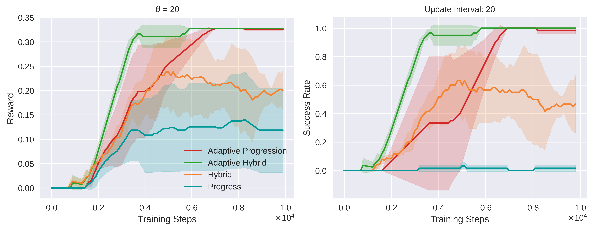

# Adaptive Reward Design for Reinforcement Learning

## Overview

This repository implements our method for **Adaptive Reward Design for Reinforcement Learning**, addressing the common challenge of sparse rewards when using Linear Temporal Logic (LTL) to specify complex tasks. While LTL provides precision, sparse rewards (e.g., feedback only on full task completion) often make it difficult for RL agents to learn effectively.

Our approach overcomes this by:
* Introducing **LTL-derived reward functions** that provide denser feedback compared to typical goal-achieved reward functions (which might assign 1 for completion and 0 otherwise). Our denser feedback is based on the structure of the Deterministic Finite Automaton (DFA) derived from the LTL formula, where we consider each node in the DFA as a sub-task. With our reward design, this encourages agents to complete as much of a task as possible, not just the final goal.
* Developing an **adaptive reward shaping mechanism** that dynamically updates these LTL-derived reward functions during the learning process. This guides the agent more effectively based on its progress. While assigning partial rewards for solving sub-tasks (as illustrated in our toy example) can be beneficial, it also risks the policy converging to a sub-optimal solution that completes only early sub-tasks. Our adaptive reward design specifically addresses this issue of getting trapped in sub-optimal policies, a capability supported by theoretical guarantees (see Theorem 1 in our paper).

The key idea is to reward incremental progress and adapting the learning signals as the agent explores. This repository contains the code to reproduce the experiments and utilize the proposed methods. Experimental results on a range of benchmark RL environments demonstrate that our approach generally outperforms baselines, achieving earlier convergence to a better policy with higher expected return and task completion rate.


## Introduction
We observed that **optimizing a policy in terms of reward** does not always align with **optimizing a policy for task completion**, particularly when using LTL-based reward shaping. To illustrate this, we provided a toy example in our paper. 

The following plots illustrate the performance comparison in the toy environment:



The plots on the left and right show the average reward during training and the success rate over time. Comparisons with QRM, CRM, and HRM in more complex environments are presented in our paper.

## Installation 

We have tested with Python 3.8.18 and Conda 23.7.4 on Ubuntu 20.04. We recommend using an Anaconda virtual environment

You might need `pythonx.x-dev` package matching your python version installed with apt-get, and 
the following.
```bash
sudo apt-get update
sudo apt-get install build-essential
```

```bash
conda create -n psltl python=3.8
```
### Download this folder

Go to Files - Github.
Click 'Download this folder' to download zip file.
<!-- ### Clone the Repository

```bash
git clone https://github.com/IngyN/PartialSatLTL.git
``` -->

### Install the Package
```bash
cd AdaptiveRewardShaping
pip install wheel==0.38.4
pip install setuptools==65.5.0
pip3 install -e .
```

### Mujoco Installation

Please follow the instructions on the webpage: https://github.com/openai/mujoco-py

### Troubleshooting Possible Errors
If you face errors while building the gym package's wheel, such as:
```bash
wheel.vendored.packaging.requirements.InvalidRequirement: Expected end or semicolon (after version specifier) opencv-python>=3.
```

Please refer to this GitHub issue for solutions (https://github.com/openai/gym/issues/3202).


## Testing the Installation

### Running Tests

#### List of Arguments
- `--algo_name`: str (RL algorithm)
- `--missing`: bool (Test with infeasible environment)
- `--noise_level`: float (Determine likelihood of noisy action)
- `--use_one_hot`: bool (Use one-hot encoding for automaton states)
- `--node_embedding`: bool (Use node embedding for automaton states)
- `--default_setting`: bool (Use default hyperparameters for each algorithm)
- `--env_name`: str (e.g. office, water, toy, cheetah, etc.)
- `--reward_types`: p (Options: p - progress, h - hybrid, n - naive)
- `--use_adrs`: bool (Enable or disable adaptive reward shaping)
- `--hybrid_eta`: float (Trade-off factor between negative and positive feedback)
- `--ards_update`: int (Frequency of adaptive reward shaping updates)
- `--adrs_mu`: float (Parameter for the trade-off between past and upcoming experiences)
- `--episode_step`: int (Maximum steps per episode)
- `--total_timesteps`: int (Total timesteps for each run)
- `--total_run`: int (Number of times to run the same environment for accurate performance measurement considering standard deviation)
- Numerous other hyperparameters available for RL algorithm settings.

#### Usage Examples:
Vary `--reward_types` n, p, h to test with reward functions: naive, progress, and hybrid, respectively.

**Note** `--default_setting True` automatically use hyperparameter reported in the paper. We have used seeds 0 to 9 for 10 independent runs.
For noisy or infeasible environments runs, additional arguments like `--noise_level=0.1` or `--missing=True` can be appended.


##### Toy
```bash
python run.py --env_name toy --total_timesteps 10000 --total_run 1 --episode_step 25 --reward_types p --default_setting True --seed 0 --algo_name dqn --use_adrs True --node_embedding True --eval_freq 100
```

```bash
python run.py --env_name toy --total_timesteps 10000 --total_run 1 --episode_step 25 --reward_types p --default_setting True --seed 0 --algo_name dqn --node_embedding True --eval_freq 100
```

##### Office
```bash
python run.py --env_name office --total_timesteps 60000 --total_run 1 --episode_step 100 --reward_types p --default_setting True --seed 0 --algo_name dqn --adrs_update 25 --use_adrs True --node_embedding True --eval_freq 100
```

##### Taxi
```bash
python run.py --env_name taxi --total_timesteps 500000 --total_run 1 --episode_step 200 --reward_types p --default_setting True --seed 0 --algo_name dqn --use_adrs True --node_embedding True --eval_freq 1000
```

##### Water
```bash
python run.py --env_name water --total_timesteps 2000000 --total_run 1 --episode_step 600 --reward_types p --default_setting True --seed 0 --algo_name ddqn --adrs_update 1000 --use_adrs True --use_one_hot True --map_id 3 --eval_freq 1000
```

##### HalfCheetah
For DDPG,
```bash
python run.py --algo_name ddpg --env_name cheetah --total_timesteps 2000000 --total_run 1 --episode_step 1000 --reward_types p --default_setting True --seed 0 --adrs_update 100 --use_adrs True --use_one_hot True --eval_freq 1000
```

For A2C,
```bash
python run.py --algo_name a2c --env_name cheetah --total_timesteps 2000000 --total_run 1 --episode_step 1000 --reward_types p --default_setting True --seed 0 --adrs_update 500 --use_adrs True --use_one_hot True --eval_freq 1000
```

For PPO,
```bash
python run.py --algo_name ppo --env_name cheetah --total_timesteps 2000000 --total_run 1 --episode_step 1000 --reward_types p --default_setting True --seed 0 --adrs_update 500 --use_adrs True --use_one_hot True --eval_freq 1000
```

### Baseline Runs
For Baselines run, please refer to the following GitHub repositories:

QRM: https://bitbucket.org/RToroIcarte/qrm/src/master/

CRM: https://github.com/RodrigoToroIcarte/reward_machines

#### For QRM:
Change your current directory to `./psltl/baseline_algo/qrm/src` and use the following commands:

##### Office
- Deterministic:
```bash
python run.py --algorithm="qrm-rs" --world="office" --map=0 --num_times=10 --batch_size=1 --buffer_size=1
```
- Noise:
```bash
python run.py --algorithm="qrm-rs" --world="office" --map=0 --num_times=10 --batch_size=1 --buffer_size=1 --noise_level=0.1
```
- Infeasible:
```bash
python run.py --algorithm="qrm-rs" --world="office" --map=0 --num_times=10 --batch_size=1 --buffer_size=1 --missing=True
```

##### Taxi
 - Deterministic: 
 ```bash
 python run.py --algorithm="qrm-rs" --world="taxi" --map=0 --num_times=10 --batch_size=1 --buffer_size=1
 ```
 
##### Water
 - Deterministic: 
 ```bash
 python run.py --algorithm="qrm-rs" --world="water" --map=3 --num_times=10 --batch_size=32 --buffer_size=50000
 ```

For noisy or infeasible environments runs, additional arguments like `--noise_level=0.1` or `--missing=True` can be appended.

#### CRM and HRM
Change your current directory to `./psltl/baseline_algo/crm` and use the following commands:

##### Office
 - Deterministic: 
 ```bash
 python run.py --alg=qlearning --env=Office-single-v0 --num_timesteps=6e4 --gamma=0.95 --env_name="office" --seed 0 --use_crm --eval_freq=100 --use_rs
 ```
 - Noise: 
 ```bash
 python run.py --alg=qlearning --env=Office-single-v0 --num_timesteps=6e4 --gamma=0.95 --env_name="office" --seed 0 --use_crm --eval_freq=100 --use_rs --noise_level 0.1
 ```
 - Infeasible: 
 ```bash
 python run.py --alg=qlearning --env=Office-single-v0 --num_timesteps=6e4 --gamma=0.95 --env_name="office" --seed 0 --use_crm --eval_freq=100 --use_rs --missing True
 ```
 
##### Taxi
 - Deterministic: 
 ```bash
 python run.py --alg=qlearning --env=Taxi-v0 --num_timesteps=5e5 --gamma=0.9 --env_name="taxi" --seed 0 --use_rs --use_crm --eval_freq=1000 
 ```
  
##### Water
 - Deterministic: 
 ```bash
 python run.py --alg=deepq --env=Water-single-M3-v0 --num_timesteps=2e6 --gamma=0.9 --env_name="water" --use_crm --seed 0 --use_rs
 ```
 
##### HalfCheetah
 - Deterministic: 
 ```bash
 python run.py --alg=ddpg --env=Half-Cheetah-RM2-v0 --num_timesteps=2e6 --gamma=0.99 --env_name="cheetah" --use_crm --seed 0 --normalize_observations=True
 ```
For noisy or infeasible environments runs, additional arguments like `--noise_level=0.1` or `--missing=True` can be appended.

**Note**: For CRM run, only one run will be executed. To test multiple run results, change the seed. We have used seeds 0 to 9 for 10 independent runs
For HRM run, simply change `--alg=qlearning` command to 1) `--alg=hrm` for Office and Taxi worlds, and 2) `--alg=dhrm` for Water and HalfCheetah worlds.


## Scalability

| Algorithm | On-Policy | Off-Policy | Compatability |
| -------- | :--------: | :--------: | ----------------|
| QRM | - | ✓ | DQN, DDQN |
| HRM, CRM | - | ✓ | DDPG, DQN, DDQN |
| Ours | ✓ | ✓ | DDPG, TD3, SAC, PPO, A2C, DQN, DDQN (customized from stable-baseline3) |


## Reproducibility for the results

### Computing Resources
**Note**: Experiments were primarily conducted on a server using the Slurm scheduler. We ran experiments in parallel, specifying `--total_run 1` while varying the seed from `--seed 0` to `--seed 9` for both CRM and our approach. For QRM, we conducted 10 runs specifying `--num_times=10`. The execution times for each run varied based on the specific environment:
- Office World: Each run took between 5 to 10 minutes.
- Taxi World: Each run required approximately one hour.
- Water World: Each run took more than a day to complete.
- HalfCheetah World: Each run also took more than a day.

Note that the running time varied depending on the type of reward function used. 
Empirically, we observed that runs with hybrid reward functions typically took significantly more time. 
In the case of Water and Cheetah worlds with hybrid functions, each run took approximately 2 to 4 days to complete.

If you have limited computing resources, we suggest using Progress reward function, as they require less time to run and still demonstrate good performance compared to Reward Machine methods.

We note the hardware specifications upon which all experiments were conducted:
#### Hardware Specification
When running without a GPU, we recommend focusing on the grid world examples (Office and Taxi) with at least a 10th gen i7 CPU and 8GB of RAM. 
However, for the other environments, we recommend using a GPU enabled server or desktop with 16GB RAM and a CUDA enabled GPU such as an RTX 2080 or later.

### How to Plot
To ensure the reproducibility of the result plots presented in the paper, we have organized the relevant plot-related files into the results_plot folder.

For monitoring and tracking reward and success rates during training, we have implemented custom callbacks and utilized evaluate_policy.py, which is derived from the stable-baselines3 library. These functionalities can be found in the following files: `psltl/rl_agents/common/callbacks.py` and `psltl/rl_agents/common/evaluation.py`.

The results obtained from the callbacks, including reward and success rate, are stored in the `/log` folder with a specific format: `/log/environment's name/reward function name, adrs, automaton representation/seed/evaluations.npz`. Additionally, the trained model is saved as `RL algorithm.zip` in the same log folder.

In order to facilitate result visualization and comparison across all algorithms, we convert the saved npz files into CSV format. Please note that the saved file types may vary for QRM and CRM, as they are based on the original implementations. For more detailed instructions, please refer to the README.md file included in the corresponding folder.

## Repository Structure

### Environments
1. `psltl/envs/skeletons`: Core files for RM or LTL environments (not specific to environments like office, toy, etc.).
2. `psltl/envs/common`: Specific environment designs (state, dynamic, action) like office, toy, mujoco, etc.
3. `psltl/envs/ltl_envs`: LTL environments based on the designs in the "common" folder. These can be continuous control or grid world environments.

### Linear Temporal Logic
1. `psltl/ltl/ltl_infos`: Saved LTL information for each environment (number of states, transitions, etc.).
2. `psltl/ltl`: Include python files to encode LTL formular with DFA using lydia library (`generate_ltl.ipynb` and `partial_sat_atm.py`), and load the saved DFA (`partial_sat_atm_load.py`). **Note**: In order to run generate_ltl.ipynb, you should use docker, and follow the instruction from here: https://github.com/whitemech/logaut. If you are using virtual environment, you should execute the following terminal command in the directory of your virtual environment; 
```
echo '#!/usr/bin/env sh' > lydia
echo 'docker run -v$(pwd):/home/default whitemech/lydia lydia "$@"' >> lydia
sudo chmod u+x lydia
```

For example, my virtual environment directory is 'home/mj/anaconda3/envs/psltl/bin', and I type the terminal command on the directory.

### Reward Functions
1. `psltl/reward_functions/reward_function_standards.py`: Contains naive, progress, hybrid reward function classes.

### Algorithms
1. `psltl/rl_agents`: Customized RL agents for generic environments, typically used for LTL environments. Includes a custom evaluation method for success rate tracking.

### Training
1. `psltl/learner/learner.py`: Executes the algorithm.
2. `psltl/learner/learning_param.py`: Defines learning parameters.
3. `psltl/learner/ltl_learner.py`: Sets up the LTL environment and RL algorithms

### Plot
1. `results_plot`: Plot Results

**Citation:** If you use this code or build upon it, please cite:

```bibtex
@inproceedings{Kwon2025AdaptiveReward,
  title     = {Adaptive Reward Design for Reinforcement Learning},
  author    = {Kwon, Minjae and ElSayed-Aly, Ingy and Feng, Lu},
  booktitle = {Proceedings of the Conference on Uncertainty in Artificial Intelligence (UAI)},
  year      = {2025},
}
```

**Contact:** For questions or collaborations, please contact:

Minjae Kwon - hbt9su@virginia.edu

## License

This project is licensed under the MIT License - see the [LICENSE](LICENSE) file for details.
